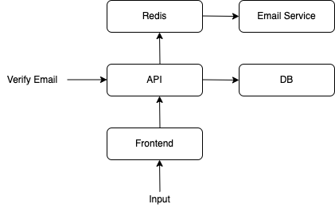
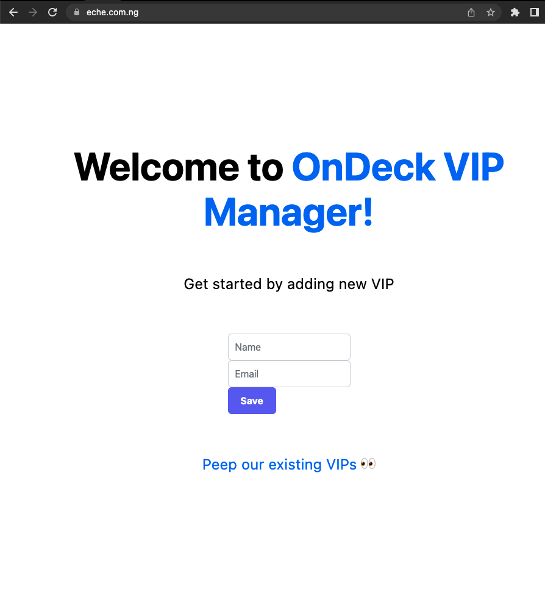
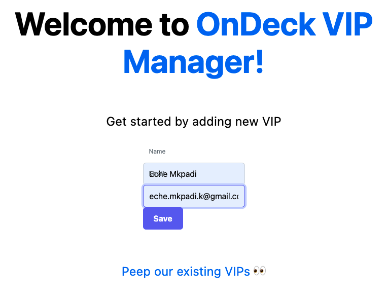
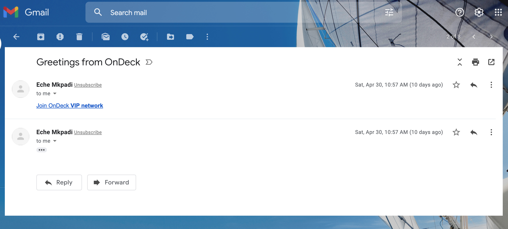
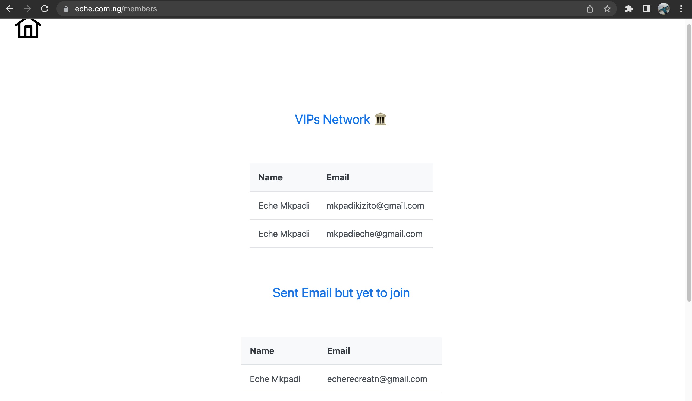

# VIP Manager

This is an [OnDeck](https://ondeck.com/) assessment project and my first experience with [Next.Js](https://nextjs.org).

## Project set up

- Install [Node.Js](https://nodejs.dev/learn/how-to-install-nodejs) if not installed.

- Set up database

[Guide to install MySQL on Ubuntu](https://www.digitalocean.com/community/tutorials/how-to-install-node-js-on-ubuntu-20-04)

[Visit MySQL's official page](https://dev.mysql.com/doc/mysql-getting-started/en/) for other systems.

Note that the application was tested on [MySQL](https://dev.mysql.com/doc/mysql-getting-started/en/)

Create a new database in MySQL:

```bash
  mysql -u username -p  # login into a mysql user account
```

```sql
  CREATE DATABASE database_name;
```

- Install [Redis](https://docs.redis.com/latest/rs/installing-upgrading/) which will be used for the Pub/Sub (Messaging).

Install redis on Ubuntu:

```bash
  sudo add-apt-repository ppa:redislabs/redis
  sudo apt update
  sudo apt install redis-server
  redis-server -v # confirm that redis install was successful
```

- Clone the [repository](https://github.com/dipperLyra/user-manager.git).

- Change into the project directory `cd user-manager`

- Run `npm install`

- Copy .env file `cp .env.sample .env`

- Edit .env file to match your system properties. To avoid any incidence that could result in a civil war, I would not recommend any editor. My family and I would go with vim 🙅🏾‍♂️

- First time only. Run `npm run build-start` to build and start the project. Subsequently, `npm start` would suffice.

- Open a new terminal and navigate to the project root directory. Run `node mailer/email.js` to start the mailing service.

I understand that the project set up is too manual and that can improved upon. I intend to work on it in time.

## Technical Details

This project will attempt to profer a solution for OnDeck to manage its network of VIPs.

Some technical tools used:

- Programming Language: JavaScript

- Framework: Next.Js

- Database: MySQL

- SQL Framework: Sequelise

- Messaging platform: Redis

### Why I chose JavaScript

My decision to use JavaScript is primarily because Keith had mentioned during our chat that the bulk of OnDeck's codebase is built on JavaScript.
Therefore, I reckoned it will be a good decision to build with it.

### Why did I choose Next.Js

Why use a framework?
A framework would make it possible to build the core of the application very fast.
Besides Keith also mentioned that the company's frontend is built on React.
Searching a bit for a framework that is built on React, I came across a lot suggestions to use Next.Js.

Poking around a bit more showed that Next.Js is also configurable.

A fullstack framework that sort of just worked out of the box felt like luxury.

### Why I chose MySQL, Sequelise and Redis

I use PostgreSQL and MySQL but I am more comfortable with MySQL.

I decided to use an ORM like Sequelise to make it easier to swap out database servers without changing application code.

Redis was an easy choice for Pub/Sub because I thought I would eventually use the same Redis server for caching as well.

The Pub/Sub (Messaging) architecture would give the messaging system the robustness required by OnDeck.

### Project architecture



The Redis server sitting at the edge in this drawing forms the cornerstone on which the extensibility of this project lies.

Using a Pub/Sub (Messaging) architecture makes it very easy to add new services.
All that would be required from the new service is to subscribe or publish to the relevant Redis channel.
This makes the application very extensible. The email service is a good example of this. The email service subscribes to a channel. It knows how to construct emails from the message object received.

With slight modifications the email service can even be used in many other applications simultaneously.
It is just a single JavaScript file that subscribes to a Redis channel. It could have been implemented in any language or even hosted anywhere.

The Pub/Sub architecture helps to guarantee that a task would still be carried out even if the service responsible is out at the time it is needed.
Whenever the subscriber comes back online, it would read the messages available and perform the necessary actions. In this particular case, it would send out all the pending emails.

The frontend is the primary mode of interaction for humans. Although, an improvement would be to make a proper API that developers can use without having any knowledge of the frontend.

The frontend passes every request to the API. For example, when a user fills the form and clicks Submit. The frontend would send this request to the API. The API would then take care of saving the data to the database. The API would also publish message to the relevant Redis channel to trigger the email service. If the email service is up and the email is successful, there would be a link sent to the user. Clicking the link would trigger an API endpoint to update the user status in the database. Signifying that the user has joined OnDeck network.

The API's interaction with the database is made database agnostic by using ORM(Sequelise). This way swapping out databases would be a matter of changing config file.

In summary this project interact with other systems through the API and would interact with humans through the frontend.

### Project in use

- Navigate to eche.com.ng or your localhost if you are running a local setup.


- Enter your name and email and click the 'Save' button.


- Check your email for a message from eche@eche.com.ng. If you are running a local set up it would use the email address in your mail settings in the .env file.


- Click on the link sent to your email to accept the invite.

- Check the webpage to see that your name and email now appears as one of the members of OnDeck network.


The members page also tracks people that are yet to join the network. An improvement in the system could be to add a button for the OnDeck network manager to send email reminders from the table.

### Summary

The project was done under a tight deadline therefore it leaves room for some improvements. Nonetheless the foundation has been laid for a great project.

The Redis server lies at the core of what will connect the API with other peripheral services.
That is, services that are not really at the core of this project rather they can be used in multiple projects simultaneusly. An example being the mailing service.

The Redis server is also intended for caching even though I did not get to implement that.

The project is built on top of Next.Js because it is about the best JavaScript fullstack application that offers React.Js support out of the box. Since the company's codebase JavaScript and React.Js I reckoned this would be a nobrainer.

In order to meet the timeline set for this project most of the tests were unfortunately done with `console.log(...)`
